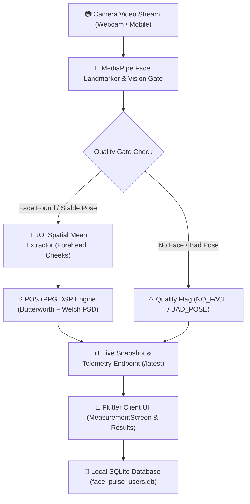

# 🫀 Face Pulse

**Face Pulse** is a state-of-the-art, non-invasive biometrics tracking application and computer vision engine. It estimates real-time vital signs—including **Heart Rate (BPM)**, **Heart Rate Variability (HRV)**, **Blood Oxygen (SpO2 %)**, **Blood Pressure (Systolic / Diastolic)**, and **Respiration Rate (br/min)**—using contactless **Remote Photoplethysmography (rPPG)** via a standard webcam or mobile camera.

Face Pulse combines a high-performance **Python OpenCV & MediaPipe Computer Vision Pipeline** with a **FastAPI backend server** and a **cross-platform Flutter frontend application**.

---

## 🌟 Key Features

- **Contactless rPPG Pulse Extraction Engine**:
  - Implements the **Plane-Orthogonal-to-Skin (POS)** algorithm to extract subtle skin blood volume pulses from RGB video streams.
  - **DSP Signal Processing**: 4th-order Butterworth bandpass filter (0.7 Hz – 3.0 Hz / 42–180 BPM range), Welch Power Spectral Density (PSD) estimation, Signal-to-Noise Ratio (SNR dB) computation, and velocity-limited Exponential Moving Average (EMA) smoothing.
  - **Accelerated Warmup**: Fast 3-second (90 frames @ 30 FPS) rPPG signal accumulation for instant live heart rate acquisition.

- **MediaPipe Facial Landmark Tracking & Cybernetic HUD**:
  - 468-point 3D facial landmarker tracking with anatomical Region-of-Interest (ROI) spatial mean extraction across the **Forehead**, **Left Cheek**, **Right Cheek**, and **Global Skin**.
  - **Head Pose Estimation**: 3D `solvePnP` head rotation tracking (**Yaw**, **Pitch**, **Roll**) and bounding box coverage ratio evaluation.
  - **Cybernetic Debugger HUD**: Real-time OpenCV visual debug window featuring bio-wireframe mesh rendering, landmark reticles, and live telemetry overlays.

- **Comprehensive Multi-Factor Video Quality Assessment**:
  - Focuses heavily on **Face Detection** presence and **Head Position Stability**.
  - **No Face Found Protection**: Automatically flags invalid frames (`NO_FACE`) and rates video quality as **1 Star (`POOR`)** if the face is not found.
  - **Head Movement & Pose Shift Penalties**: Evaluates head pose drift (`BAD_POSE`, `FACE_MISALIGNED`) and illumination variance (`LOW_LIGHT`, `OVER_EXPOSED`).

- **Local SQLite Database Persistence**:
  - Built-in SQLite database (`face_pulse_users.db`) storing user credentials (with SHA-256 password hashing), health profiles, and per-user isolated vitals diary scan history.
  - **Strict Per-User History Isolation**: Scan history and trend graphs are strictly isolated per logged-in user account.

- **Cross-Platform Flutter Frontend**:
  - Premium modern UI featuring animated ECG live waveform rendering, scanline animations, interactive vitals result cards, trend graphs, and profile management.
  - **Healio AI Assistant**: Dynamic health assistant providing interactive demo questions, health insight response cards, and personalized biometrics guidance.

---

## 🏗 System Architecture



---

## 📂 Project Structure

```
Face Pulse/
├── app/                                  # FastAPI Backend Application
│   ├── main.py                           # API Entrypoint & Request/Response Logging Middleware
│   ├── routes/                           # API Route Endpoints
│   │   ├── measurement_routes.py         # Start/Stop Session & /latest Snapshot Endpoint
│   │   ├── auth_routes.py                # Signup & Login Authentication Endpoints
│   │   ├── user_routes.py                # Profile Reading & Onboarding Update Endpoints
│   │   ├── diary_routes.py               # Vitals Diary History Endpoints
│   │   └── guardian_routes.py            # Guardian Connect Endpoints
│   ├── schemas/                          # Pydantic v2 Request/Response Schemas
│   ├── services/                         # Business Logic & Core Services
│   │   ├── user_store.py                 # SQLite Database Engine (face_pulse_users.db)
│   │   ├── diary_service.py              # Isolated Per-User Vitals Diary Service
│   │   ├── quality_service.py            # Multi-Factor Video Quality Evaluator
│   │   ├── debugger_runner.py            # Async Camera Debugger Runner Thread
│   │   ├── signal_service.py             # Signal Analytics & Vitals Conversion
│   │   └── onboarding_service.py         # Health Profile Calculation (BMI, DOB)
│   └── models/                           # Enums & Data Models
├── lib/                                  # Cross-Platform Flutter Frontend Application
│   ├── main.dart                         # Flutter App Router & State Entrypoint
│   ├── screens/                          # UI Screens
│   │   ├── measurement_screen.dart       # Live Camera Scan, ECG Waveform & Polling
│   │   ├── results_screen.dart           # Scan Vitals Summary & Star Rating Display
│   │   ├── diary_screen.dart             # Per-User Trend Graphs & History Timeline
│   │   ├── profile_screen.dart           # Dynamic Local DB User Profile Management
│   │   ├── chat_screen.dart              # Healio AI Assistant
│   │   ├── signin_screen.dart            # User Sign In Screen
│   │   ├── signup_screen.dart            # User Registration Screen
│   │   └── onboarding_screen.dart        # User Health Onboarding Flow
│   ├── theme/                            # App Theme & Color Tokens
│   └── components/                       # Reusable UI Widgets & Custom Painters
├── rppg_processor.py                     # Core POS rPPG Pulse Engine & DSP Processor
├── face_feature_extractor.py             # MediaPipe 3D Landmarker & Vision Quality Gates
├── visual_debugger.py                    # OpenCV Visual HUD Window Debugger
├── face_pulse_users.db                   # Local SQLite Database File
└── requirements.txt                      # Python Package Dependencies
```

---

## 👤 Default Test User Credentials

The local SQLite database (`face_pulse_users.db`) comes pre-seeded with a default test user account:

| Parameter | Value |
| :--- | :--- |
| **Full Name** | `HemKumar` |
| **Email** | `hemkumarr2803@gmail.com` |
| **Password** | `hem@1234` |
| **Height** | `170 cm` |
| **Weight** | `60 kg` |
| **Calculated BMI** | `20.76` (Normal) |
| **Date of Birth** | `2004-12-12` |
| **Blood Group** | `O+` |
| **Gender** | `Male` |

> [!NOTE]
> You can also register a new account on the **Sign Up** screen. New user accounts are automatically stored in the local SQLite database and can be logged into anytime using their registered email and password.

---

## 🚀 Quick Start & Installation

### Prerequisites

- **Python**: Version 3.10 or higher
- **Flutter**: Version 3.19 or higher

---

### 1. Backend Setup (FastAPI & Python rPPG Engine)

```bash
# Clone the repository
git clone https://github.com/hemscodes28/face_pulse.git
cd "face_pulse"

# Create a Python virtual environment (optional but recommended)
python -m venv venv
# On Windows:
venv\Scripts\activate
# On Linux/macOS:
source venv/bin/activate

# Install dependencies
pip install -r requirements.txt

# Start the FastAPI Backend Server
python -m uvicorn app.main:app --host 127.0.0.1 --port 8000 --reload
```

The backend server will start at `http://127.0.0.1:8000`. You can explore the interactive API documentation at `http://127.0.0.1:8000/docs`.

---

### 2. Frontend Setup (Flutter Application)

```bash
# Fetch Flutter packages
flutter pub get

# Run on Web / Desktop / Emulator
flutter run
```

---

### 3. Running the Standalone OpenCV Visual Debugger HUD

To inspect the real-time camera feed with cybernetic bio-wireframe mesh rendering and live rPPG signal telemetry in an OpenCV window:

```bash
python visual_debugger.py
```

---

## 🧪 Testing & Verification

Run the Python verification test suite to validate rPPG DSP signal calculation, quality gate evaluation, and SQLite database storage:

```bash
python test_engine.py
```

---

## 🛡 Disclaimer

> [!IMPORTANT]
> **Face Pulse** is designed for general wellness and self-awareness purposes only. It is **not a medical device** and is not intended to diagnose, treat, cure, or prevent any medical condition. Always consult a qualified healthcare professional for medical advice.

---

## 📜 License

This project is licensed under the MIT License.
